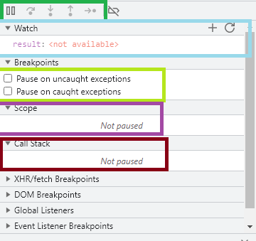

# **Ejercicios Curso JavaScript Essentials 1 Cisco**

Este repositorio contiene los ejercicios más relevantes del Curso **JavaScript Essentials 1** dictado por CISCO Networking Academy. Dicho curso se compone de los siguientes 6 módulos:

-**JSE: Module 1: Introduction to JavaScript and Computer Programming**

-**JSE: Module 2: Variables, Data Types, Type Casting, and Comments**

-**JSE: Module 3: Operators and User Interaction**

-**JSE: Module 4: Control Flow – Conditional Execution and Loops**

-**JSE: Module 5: Functions**

-**JSE: Module 6: Errors, exceptions, debugging, and troubleshooting**

-**JSE: FINAL TEST**

Se tratan varios aspectos teóricos fundamentales tales como:

-Global scope vs Local Scope

-Shadowing

-Autoboxing

-First-class members

-Operators

-Unary, Binary, and Ternary Operators

-Primitive and Complex data types

-Precedence

-Associativity

-Loops

-Conditionals

-Expression function

-Arrows functions

-Debugging

Cada módulo contiene muchos ejercicios de práctica y al final de cada módulo se debe realizar un test cuyo porcentaje de aprobación es de sobre 70%. El número de preguntas de cada módulo es el siguiente:

-Module 1 Test: **14 questions**

-Module 2 Test: **28 questions**

-Module 3 Test: **14 questions**

-Module 4 Test: **20 questions**

-Module 5 Test: **11 questions**

-Module 6 Test: **14 questions**

-Course Completion- Final Test: **30 questions**

En total, existen **131 preguntas**. Al aprobar todo se da un descuento para realizar el examen de certificación en el JavaScript Institute de 20%.

En mi caso, muchas cosas de este curso ya las manejaba en base a lo aprendido en el programa Oracle Next Education siendo lo más relevante o novedoso el aspecto del debugging en el cual se hace uso de la herramienta debugger del navegador. Se ha utilizado para recorrer las líneas de código, ver y cambiar variables locales, ver el callstack de funciones y establecer breakpoints.

